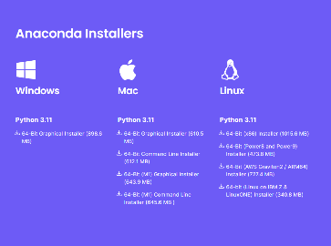
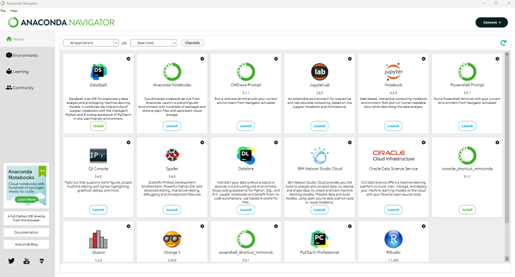

# ARP Lab
## A retirement planning laboratory

This package is a retirement modeling framework for exploring the sensitivity of retirement financial decisions. Strictly speaking, it is not a planning tool, but more an environment for exploring what if scenarios. It provides different realizations of a financial strategy. One can certainly have a savings plan, but due to the volatility of financial investments, it is impossible to have an exact and certain asset earnings plan. Moreover, it is very likely that tax laws will change in the future. That does not mean one cannot make decisions. This is where this tool fits it. Given your savings and spending desires, it can generate different future realizations of your strategy under different market assumptions, helping to better understand one's financial situation.

This is a tool for helping retirement planning. It generates future scenarios under different assumptions. Using this platfom, one can test the robustness of a retirement plan under historical or statistical rates of return and inflation. It can also be used to test the success of a 4% withdrawal rate, the effect of a part-time income at retirement, the possibility of purchasing of a second house in your 60's, and so on. Income tax calculations for the US federal tax are included, but no state income tax calculations are (yet) included. If you're in Texas or Washington State, you're all set!

Copyright Martin-D. Lacasse (2023)

Disclaimer: I am not a financial planner. You make your own decisions. This program comes with no garanteee. Use at your own risk.
---------------------------------------------------------------------------------------------------------------------------------

## Rules and assumptions
ARP Lab relies on a few implicit assumptions:

- To minimize income tax, all withdrawals are taken in the following order:
    1) taxable investment accounts (CD's, bank savings accounts, stock investment accounts, etc.);
    2) tax-deferred savings accounts (e.g., 401k, 403b, etc.);
    3) tax-free savings accounts (Roth IRA, Roth 401k, etc.).
    - Single and Married Filing Jointly are currently the only two choices for income tax calculations;
- Rates of return provided for the S&P 500 data include dividends;
- No investment administration fees are accounted for;
- No elaborate tax strategies are considered, such as tax-loss harvesting strategy, net unrealized appreciation, or even reduced rates on long-term capital gains;
- Contributions are assumed to be made at half-year, in the hope of averaging periodic contributions made evenly through the year;
- No estate tax calculations are included. Only tax on the tax-deferred portion of the estate is accounted for when reporting estate value in today's $;
- For spouses, surplus over the desired joint income will be deposited in taxable accounts proportionally to that year's spousal income ratio;
- Tax and IRMAA brackets are assumed to follow inflation;
- Social security benefits are assumed to be adjusted for inflation;
- Most importantly, tax rules are projected in the future without any consireration on likely changes to happen with new administrations.

## Default values for parameters
When a new plan is created, ARP Lab will list all the default assumptions as a reminder. All these parameters can be changed with simple commands.
The default choices include:

- Assets allocation is 60% S&P 500 and 40% corporate bonds for tax-deferred and tax-free savings accounts;
- Assets allocation is 25% corporate bonds, 55% 10-year Treasury bonds, and %25 common assets for taxable investment accounts; 
- Income for surviving spouse will be %60 of the income of the couple; 
- Spousal withdrawals are set to *auto*, allowing coordination between both accounts; 
- Income tax on estate is assumed to be 25% on the taxable portion of the estate; 
- Default rates are average rates over the last 30 years.

These choices have no particular value, except to provide a default case that one can run for demonstration purposes.
It is anticipated that you will change these default values by using `set___()` functions. The *jack+jill* notebook contains configuration examples describing how to make these values
match your own assumptions. These include the following calls:
    `setInitialAR()`, `setFinalAR()`, `setSurvivingFraction()`, `setSpousalSplit()`, `setEstateTaxRate()`,  `setRates()`, for examples.

## Requirements to run this program
ARP Lab is coded in Python and is best run using either the *jupyterlab* or *jupyter* notebook. Therefore, I recommend installing *Anaconda* on your computer. It can be found at anaconda.com. Follow the instruction on the web site to install anaconda on your computer.

The Jupyter Notebook interface is a Web-based application for authoring documents that combine live-code with narrative text, equations and visualizations.

The intent of using a notebook is that one can configure calculations that suit one's needs. Moreover, running calculations in JupyterLab is made to be relatively easy. There are many tutorials on that topic and a summary is given below.

### Getting started
To run the demo version describing a hypothetical case:
1) Start the Anaconda Navigator. This has a green circle representative icon.
2) Launch a JupyterLab session by clicking *Launch* under the *JupyterLab* icon.
3) Using the navigation panel on the left, get to the directory where you unzipped ARP Lab.
4) Open the *jack+jill.ipynb* notebook from the browser interface of JupyterLab.
5) Follow instructions therein.

To edit files and run your own cases:
1) Make a copy of the files *template.ipynb* and *template.xlxs*.
2) Rename the copied files to something relevant to your case, say *kim+sam.ipynb* and *kim+sam.xlsx* if you are Kim and Sam.
3) Edit each tab of the *kim+sam.xlsx* file to reflect your names, wages, contributions, and large financial events (a.k.a., big-ticket items).
4) Open *kim+sam.ipynb* notebook in the JupyterLab interface.
5) Add the additional information and assumption required to run a case;
6) Give me some feedback for improvement.

# Intro to Jupyter
## Installation
Installation of Anaconda is relatively straightforward, just go to this [link](http://anaconda.com/), and click the download icon

which should automatically detect your operating system. Else, you could look for the _Anaconda installers_ box at the bottom of the web page. At the time of this writing, the latest version is Anaconda 23.7.4 or 2023.07.2 using Python 3.11.

There will be a few installation steps to click through - you can generally use the defaults. For detailed instructions, here are the particular OS installation guides:

- [Windows computers](https://docs.anaconda.com/free/anaconda/install/windows/)
- [MacOS](https://docs.anaconda.com/free/anaconda/install/mac-os/)
- [Linux](https://docs.anaconda.com/free/anaconda/install/linux/)

## Opening the Anaconda Navigator

Following a successful installation, you should be able to open the Anaconda navigator.

### Windows computers

Click on the Windows Icon and search through the applications installed on your computer and open via the Anaconda Icon, which should look like this icon. Alternatively, you can type *anaconda-navigator* in the search tool located in the task bar (notice that, by default, searching in Windows is not case sensitive).

### MacOS

Open your Finder and go to the *Applications* Folder, look for *Anaconda-Navigator*, with the same icon you see above.

### Linux

Open a terminal window and type *anaconda-navigator*.
Upon successfully opening the navigator you should see something resembling the following window. Be patient, it sometimes takes a while to load.

The navigator can be used to start many applications. Those of interest to us are mainly the Jupyter Notebook reader and a terminal shell. The advantage of starting a command shell from the navigator is that all the environment variables are already pre-configured for Python. On Windows, we recommend using the PowerShell Prompt over CMD, as the former provides command line editing and history and is therefore more user friendly.

## Opening a Jupyter notebook

Start the anaconda navigator and launch the Jupyter Notebook interpreter by clicking on the Launch button of the icon shown here.

The Jupyter Notebook interpreter will start a virtual web server on your computer (localhost) that will be visualized through your default web browser. One can also choose JupyterLab which has a few more features. Either one will work fine.

The opening page will show the files on your computer. By clicking on the directories, navigate to where you saved the notebooks. As before, '..' stands for returning to the parent directory. Note that unlike other navigators (e.g., Explorer) a single click is necessary to open a directory.

Jupyter notebooks end with the *.ipynb* file extension. Clicking on the desired file will open the Jupyter Notebook interpreter of that file in a different tab of your browser. These notebooks contain intructions as well as code that can be edited and run. Boxes starting with the *In [  ]* keyword are called *code cells*; they are a block of Python code input waiting to be run. Other boxes, called *markdown cells*, are meant to give instructions. The number between brackets keeps track of the instruction numbers, showing the sequence of the instructions that were run, possibly out of order. A cell generating output will have an *Out[  ]* with an associated sequence number in the brackets. An entire notebook can be reset by restarting the kernel and clearing all output and the state of all variables. This is done through selecting *Restart and Clear Output* under the *Kernel* tab.

## Running a Jupyter notebook

To run a block of code, click on the box and the surrounding perimeter of that box will turn green, indicating that it is ready to run with hitting *Crtl-Enter*. Alternatively, *Shift-Enter* will achieve the same result, except that the mouse focus will jump to the next cell. Double-clicking on a markdown cell will switch the cell to the editing mode and show the raw (markdown) code for the text. Running the cell (*Ctrl-Enter*) will (re-)generate the nice text. Code cells, on the other end, can be edited directly once the mouse focus is on that cell (i.e., there is no need to double-click to edit those cells).

The menu at the top of the page contains the main commands and will indicate the type of cell where the mouse is focusing. Clicking on run is another way to run the current cell, equivalent to *Shift-Enter*. It is also possible to run all the cells in the notebook by selecting *Run All* under the *Cell* (Jupyter) or *Run* (Jupyter Lab) headings. Notice all the shortcuts indicated in these menus, providing a keyboard alternative. Moreover, the *Help* tab contains a *User Interface Tour*, as well as reference to the Python langage and its most popular packages such as pandas and NumPy, for example. Use these references if needed. You should minimally read the *User Interface Tour* if you are new to Jupyter Notebook.

If you want to run the all the commands in a notebook, just look under the *Run* menu and select *Run All*. For a fresh run, one can also select *Restart Kernel and Run All*.